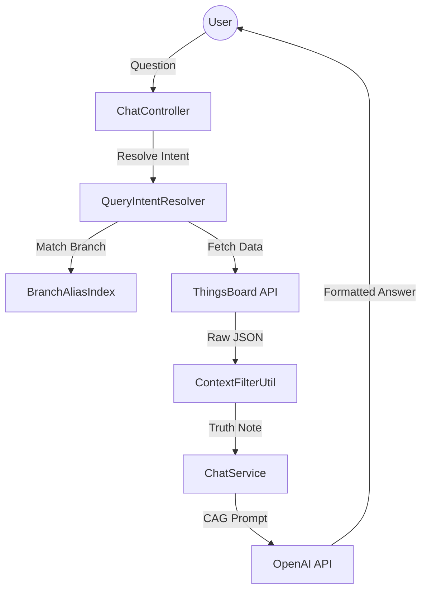

# 🤖 ThingsBoard AI IoT Assistant (SAI)

<div align="center">

[](https://github.com)
[](LICENSE)
[](https://github.com)
[](https://oracle.com/java)
[](https://spring.io)


## **Your IoT Data, Simplified. Ask. Analyze. Act. Done.**

Tired of navigating complex IoT dashboards? **We've built the "Siri" for your ThingsBoard network.**  
Real-time status reports, automated health checks, and intelligent security analysis — all through a simple chat interface.

---

### 🚀 Quick Navigation
- **[👥 I'm Not a Developer — Show me the overview](#part-1---for-everyone-)**
- **[⚙️ I'm a Developer — Show me the setup](#part-2---for-developers-)**

</div>

---

# 👥 PART 1 — FOR EVERYONE 🌍

*No coding knowledge required. Read this section in ~5 minutes.*

## Table of Contents (Part 1)
1. [What Is This Project?](#what-is-this-project)
2. [The Problem We Solve](#the-problem-we-solve)
3. [How It Works](#how-it-works-simple-explanation)
4. [Key Benefits](#key-benefits)
5. [Who Is This For?](#who-is-this-for)
6. [Live Demo & Screenshots](#live-demo--screenshots)
7. [Frequently Asked Questions](#frequently-asked-questions-non-technical)

---

## What Is This Project?

Imagine you manage a bank with 100 branches, each filled with cameras, alarm panels, and battery backups. To check if everything is working, you usually have to log into a complicated dashboard, click through 10 menus, and read rows of technical numbers.

**What if you could just ask your computer: "Are there any inactive branches?"**

That's exactly what we built. **SAI (Smart Assistant for IoT)** connects directly to your ThingsBoard platform and lets you talk to your facility data in plain English.

---

## The Problem We Solve

### The Current Situation

**For Security Managers:**
- ❌ Manually checking 100+ branches every morning is slow.
- ❌ Identifying "Offline" devices requires technical expertise.
- ❌ Finding a specific camera fault takes too many clicks.
- ❌ Historical data is hard to find and compare.

### Our Solution

We created a **Senior Security Analyst AI** that:
- ✅ Instantly identifies offline branches across your entire network.
- ✅ Explains complex sensor data (like battery voltage) in simple terms.
- ✅ Remembers your previous questions to provide detailed follow-ups.
- ✅ Anchors every answer to a specific branch so there's never confusion.

---

## How It Works (Simple Explanation)

### Step-by-Step: From Question to Answer

```
1. YOU ASK A QUESTION
   → "What is the CCTV status of BALLY BAZAR?"

2. BOT FETCHES TRUTH
   → The bot reads the real-time sensor data from ThingsBoard.

3. BRAIN ANALYZES
   → The AI looks at the numbers (e.g., "14/16 cameras online").

4. PROFESSIONAL REPORT
   → SAI formats a clean response: 
     "Branch BALLY BAZAR: CCTV Camera Status is 14 cameras ONLINE."

5. FOLLOW UP
   → You ask: "What about the battery?"
   → SAI remembers you're talking about BALLY BAZAR and gives you the voltage.
```

---

## Key Benefits

✅ **Save Time:** Get a full branch health report in 3 seconds instead of 10 minutes.  
✅ **Zero Learning Curve:** If you can send a WhatsApp message, you can use SAI.  
✅ **Mathematically Accurate:** Uses "Truth-Injection" logic to ensure counts are always correct.  
✅ **Proactive Analysis:** SAI links different data points (like power loss vs. battery drop) to warn you of risks.  

---

## Who Is This For?

### 🏦 **Bank & Facility Managers**
Monitor security and hardware health across hundreds of remote locations from one window.

### 🛡️ **Security Operations Centers (SOC)**
Quickly identify which branch needs a physical maintenance visit without digging through logs.

### 👨‍🔧 **Maintenance Teams**
Ask "What is the HDD status?" before driving to a branch so you know exactly which part to bring.

---

## Live Demo & Screenshots

### 📸 Screenshots

**Screenshot 1: The Global Overview**
  
*See your entire bank network status in one sentence.*

**Screenshot 2: Precision Reporting**
  
*Self-descriptive answers anchored to specific branch names.*

---

## Frequently Asked Questions (Non-Technical)

### 🔒 **Q: Is my data safe?**
**A:** Yes. SAI acts as a "Read-Only" analyst. It cannot change your device settings, and it only sees the data your account has permission to view.

### 📱 **Q: Does it work on my phone?**
**A:** Yes! The chat widget works in any modern web browser on desktop, tablet, or smartphone.

---

# ⚙️ PART 2 — FOR DEVELOPERS 👨‍💻

*Complete technical documentation, setup guides, and architecture details.*

## Table of Contents (Part 2)
1. [Technical Overview](#technical-overview)
2. [Tech Stack](#tech-stack)
3. [System Architecture](#system-architecture)
4. [Getting Started](#getting-started)
5. [Folder & File Structure](#folder--file-structure)
6. [Testing & Validation](#testing)

---

## Technical Overview

### Architecture Pattern: **Truth-Injection Model (CAG)**

SAI is built as a **Context-Augmented Generation (CAG)** system. Unlike standard chatbots that "guess," SAI uses a deterministic backend to pre-calculate "Truth" before the AI ever sees it.

✅ **Ambiguity Filter:** Detects queries missing a target branch and requests clarification.  
✅ **Topic Retention:** Stores "Pending Intent" in session memory to handle context-heavy follow-ups.  
✅ **Deep Mapping:** Recursively parses nested JSON telemetry (CCTV channels, HDD slots) into AI-ready structures.  

---

## Tech Stack

| Category | Technology | Version | Purpose |
|----------|-----------|---------|---------|
| **Backend** | Java | 21 | Core Language |
| **Framework** | Spring Boot | 4.0.3 | Application Framework |
| **Build Tool** | Maven | 3.8+ | Dependency Management |
| **IoT Platform** | ThingsBoard | Cloud/PE | Source of Truth (REST API) |
| **LLM Engine** | OpenAI | GPT-4o | Natural Language Processing |
| **Memory** | ConcurrentLinkedDeque | In-Memory | Stateless Session History |

---

## System Architecture



---

## Getting Started

### Prerequisites
*   **Java 21** installed and configured in `PATH`.
*   **OpenAI API Key** with GPT-4 access.
*   **ThingsBoard Credentials** (Tenant or Customer level).

### 1. Installation
```bash
git clone https://github.com/singhaganesh/ThingsBoard-Bot.git
cd ThingsBoard-Bot
```

### 2. Configuration
Edit `src/main/resources/application.properties`:
```properties
# ThingsBoard
iotchatbot.thingsboard.url=https://thingsboard.cloud
iotchatbot.thingsboard.username=your_email
iotchatbot.thingsboard.password=your_password

# OpenAI
iotchatbot.openai.api-key=sk-your-key
iotchatbot.openai.model=gpt-4o
```

### 3. Run the Bot
```bash
./mvnw clean package -DskipTests
java -jar target/ThingsBoard-Bot-0.0.1-SNAPSHOT.jar
```

---

## Folder & File Structure

```
ThingsBoard-Bot/
├── src/main/java/com/seple/ThingsBoard_Bot/
│   ├── client/              # OpenAI & ThingsBoard API Wrappers
│   ├── config/              # Security, Cache, and OpenAI Configs
│   ├── model/domain/        # Structured IoT Domain Objects (Branch, Power, CCTV)
│   ├── service/             # CORE LOGIC
│   │   ├── ChatService.java # Orchestrator (Truth-Injection Logic)
│   │   ├── normalization/   # Key mapping and Data Cleanup
│   │   └── query/           # Intent Resolution & Deterministic Answers
│   └── util/                # Token Counting & Context Filtering
└── src/main/resources/static/ # Floating Chat UI
```

---

## Testing & Validation

SAI uses a **Golden Question** testing strategy to ensure 100% accuracy.

```bash
# Run all unit and integration tests
./mvnw test
```

**Key Test Areas:**
*   `QueryIntentResolverTest`: Validates that user questions map to correct metrics.
*   `DeterministicAnswerServiceTest`: Ensures "Truth-Injection" calculates correct counts.
*   `BranchSnapshotMapperTest`: Verifies that technical ThingsBoard data is correctly unwrapped.

---
*Developed by Ganesh Singha — Senior IoT Developer.*
